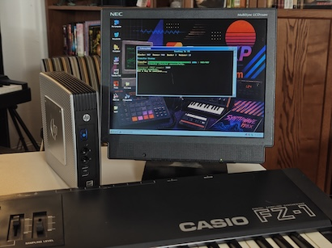
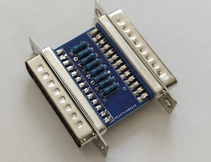
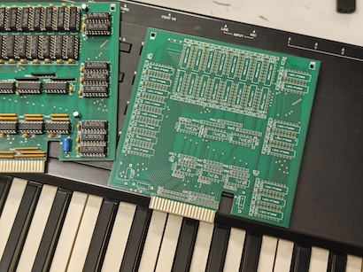
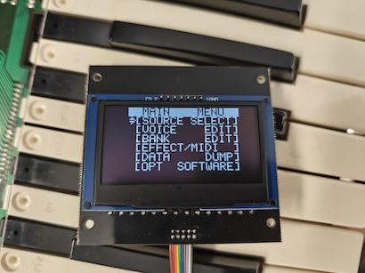
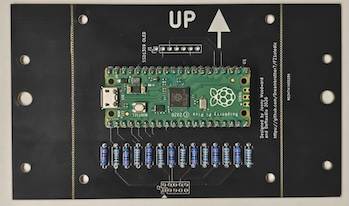
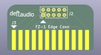

# Hardware upgrades for Casio FZ and VZ series

# (FZ-1 / FZ-10m / FZ-20m and VZ-1 / VZ-10m).

This repository is the collection of upgrades for an amazing Casio FZ-series of samplers. Some of those are also applicable for VZ-series. 

- [FZDUMP2026](#fzdump2026) data transfer software for windows

- [1MB FZ-1 Memory Upgrade](#1mb-fz-1-memory-upgrade-board) daughter card memory expansion for FZ-1 

- [Pico OLED Upgrade for FZ-1, FZ-10m, FZ-20m, VZ-1, VZ-10m](#pico-oled-upgrade-for-fz-1-fz-10m-fz-20m-vz-1-vz-10m) easy OLED upgrade for the entire Casio family

- [FZ-1 OLED Upgrade by Dmitrins](#fz-1-oled-upgrade-by-dmitrins) the original design, keep here for historic reason

- [Flashfloppy Floppy Emulator](#flashfloppy-floppy-emulator) configuration files for FlashFloppy and HxC

## FZDUMP2026

It's the new version of the original FZDUMP app for DOS that allowed data transfer between FZ-1 and PC. I has been completelly reworked in 2026 (30 years after the original code) to run on "modern" Windows - anything from and including Windows 98 SE.

It was purposely designed to use the parallel port, not rely on any microcontroller, and just initiate a transfer using a user space library to interface with LPT port. This required specific tricks in the code, since the original code used DOS interrupts.
The main motivation is to keep it legacy looking. It has a built in browser to easily manage large sound library. 

FZDUMP2026 remains open source, free of charge of all. You're highly encouraged to submit your imporvements using this Github repository. 

Deftaudio offers the complete Thin PC setups with all original and FZDUMP2026 software pre-loaded. Check the [store](https://deftaudio.com/store).  

Below is the [LPT converter](https://github.com/Deftaudio/Casio-FZ-1/tree/main/FZDUMP2026/LPT%20Converter) which is designed to adopt Casio FZ-series pinout and use with standard DB25 Male-Female extension cables to connect to PC. 

LPT converter design files are available to all. You can make your own or order PCB or assembled adapter at Deftaudio [store](https://deftaudio.com/store/tproduct/977905956434-casio-fz-1-lpt-port-adapter).

Developed by Deftaudio.

## 1MB FZ-1 Memory Upgrade board

Memory Expansion is designed to add an extra 1MB of sample memory for Casio FZ-1 (only keyboard version has an expansion slot). It replicates the1987 circuitry by leveraging off the shelf 256Kx1 DRAM chips which are easily obtainable.  

Beginner soldering skills are required. [The kit ](https://github.com/Deftaudio/Casio-FZ-1/blob/main/Memory%20Expansion/Casio%20FZ-1%20Memory%20Expansion%20-%20BOM.pdf)consists of thru hole parts only, easy to solder. It includes quality IC sockets (round pin hole ) for all components for easy installation or replacement. Assembly manual is located [here](https://github.com/Deftaudio/Casio-FZ-1/blob/main/Memory%20Expansion/Casio%20FZ-1%20Memory%20Expansion%20Assembly%20Manual.pdf).

Plug and play. Doesn't require opening FZ-1. The memory expansion slot is located on the back of the instrument.  

Works with any 256Kx1 DRAM (80ns or better) such as MB81256-80, HY53C256LS-80, KM41C256P-7, MN41256A-08 and many other equivalents.

More info on the [Product page](https://deftaudio.com/store/tproduct/857848623614-casio-fz-1-1mb-memory-expansion).

## Pico OLED Upgrade for FZ-1, FZ-10m, FZ-20m, VZ-1, VZ-10m

This is the recent [development by Dreambrother7](https://github.com/Dreambrother7/FZ1oledlc), is inspired by the original OLED by Dmitrins, but uses RPi Pico/Pico2 instead. This allowed to reduce the cost of the project, by minimazing the BOM and using easily availabled SSD1309 OLED model. 

Deftaudio designed several PCBs for this project. The base PCB assebly hosts Pico and OLED screen. It connects to the adapter board that goes into flex cable slot on Casio. The base PCB has snap off regions to be mounted in FZ-1, FZ-10m/FZ-20m or VZ-10m.  

The adapter board is unique for FZ-1 or FZ-10m/FZ-20m/VZ-10m due to a different connector type which is used on rack family. It connects with 10 pin ribbon cable (2.00mm pitch). 

You can [download](https://github.com/Deftaudio/Casio-FZ-1/tree/main/Pico%20OLED%20by%20Dreambrother7) the lastest PCB design files and Gerber from this repository while Dreambrother7 hosts the latest tested version and [firmware](https://github.com/Dreambrother7/FZ1oledlc/releases).  

You can purchase PCBs at Deftaudio [store](https://deftaudio.com/store).

Developed by Dreambrother7 and Deftaudio.

## FZ-1 OLED Upgrade by Dmitrins

This is a copy of the open source design files by Dmitrins who shared it on [Yamahamusician](https://yamahamusicians.com/forum/viewtopic.php?t=10666&start=240). 

Deftaudio doesn't sell this design. Keep it here just to preserve it.

## Flashfloppy Floppy Emulator

Just a set of configuration files and test images to get Casio FZ-1 running with Flashfloppy.   
